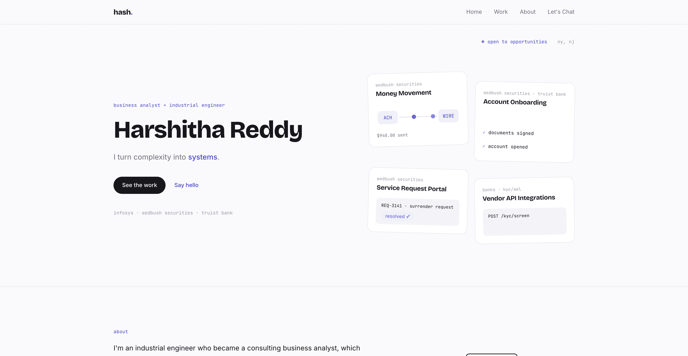

# Harshitha Reddy

I translate complex business processes into clear requirements, practical workflows, and digital products that people can confidently use.

[View Live Portfolio](https://www.harshithareddy.com) · [LinkedIn](https://www.linkedin.com/in/harshithababureddy)

## About this portfolio

This portfolio brings together my experience in business analysis, financial services, product delivery, and hands-on building.

Over the past three years, I have worked on digital banking initiatives for Wedbush Securities and Truist Bank, including:

- Account onboarding
- Money movement
- KYC and AML workflows
- API integrations
- Service request platforms

My work spans the complete product lifecycle, from discovery and requirements through UAT, launch, and post-production support.

## Selected work

### [RealPort](https://www.harshithareddy.com/work/hack-nation)

An application-readiness copilot that helps affordable housing renters understand requirements, organize documents, and prepare stronger application packets.

Demonstrates: product strategy, workflow design, document processing, responsible AI thinking, and team delivery.

### [PeriWise](https://www.harshithareddy.com/work/periwise)

A perimenopause companion that turns quiet daily check-ins into visible patterns, doctor-ready summaries scored on the Menopause Rating Scale, and gentler conversations at home through Care Circle sharing that is off by default. Started solo at the SheBuilds 48-hour hackathon, live and still growing.

Demonstrates: user research, rapid product development, health-data privacy by design, and end-to-end ownership.

### [FinConnect](https://www.harshithareddy.com/work/finconnect)

An interactive open banking simulation that allows users to trigger transaction failures and observe how the system validates, responds, and recovers.

Demonstrates: API thinking, financial workflows, exception handling, and systems communication.

## What I bring

**Business analysis.** Requirements elicitation, process mapping, user stories, acceptance criteria, stakeholder alignment, UAT, and implementation support.

**Financial services.** Account onboarding, money movement, KYC and AML, broker-dealer operations, approval workflows, and regulatory requirements.

**Systems and integrations.** REST APIs, JSON, Postman, webhooks, OAuth, JWT, data mapping, system rules, and integration documentation.

**Data and product tools.** SQL, Python, Snowflake, Tableau, Power BI, Jira, Confluence, Figma, ServiceNow, and Git.

## How I work

**Listen before solving.** I begin by understanding how people actually complete the process, where they get stuck, and what the system needs to make clearer.

**Create clarity.** I translate the same problem for executives, product teams, engineers, and QA so that every stakeholder understands what is being built and why.

**Build and validate.** I do not stop at documentation. I prototype, test, challenge assumptions, and stay involved through launch and adoption.

## About the website

I designed and built this portfolio to communicate complex work through clear storytelling, interactive product demonstrations, and evidence-backed case studies.

Built with Next.js, React, TypeScript, Tailwind CSS, Framer Motion, and Vercel. The site includes a documented design system, responsive layouts, purposeful motion, and reduced-motion support.

## Let's connect

I am exploring opportunities across:

- Business analysis
- Product and platform implementation
- Solutions engineering
- Customer-facing fintech

Based in the New York and New Jersey area.

[Explore my work →](https://www.harshithareddy.com) · [Connect on LinkedIn →](https://www.linkedin.com/in/harshithababureddy)

Designed and built by Harshitha Reddy

